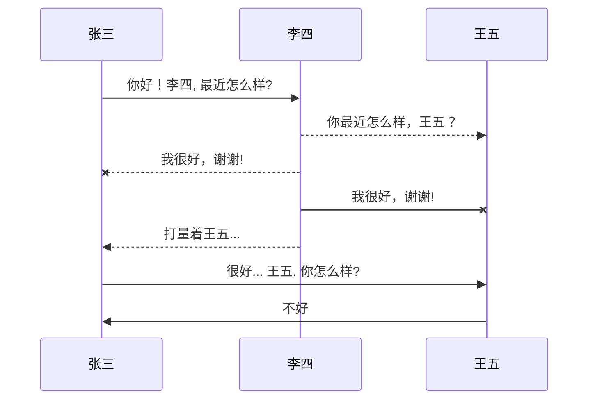

#                                     Typora

---

> 1. Typora官网：https://www.typora.io/
> 2. windows下载地址：https://www.typora.io/#windows

> 一款轻便简洁的 Markdown 编辑器和阅读器

#### 认识软件

> Typora是一款轻便简洁的Markdown编辑器，支持即时渲染技术，这也是与其他Markdown编辑器最显著的区别，将写作与预览窗口相结合，为用户呈现所见即所得的编辑模式，支持Markdown的各种基础语法，支持快捷键操作，是好用的一款Markdown编辑器。即时渲染使得你写Markdown就想是写Word文档一样流畅自如，不像其他编辑器的有编辑栏和显示栏。

####                                                                   软件特色

---

##### **实时预览**:

> 一般Markdown 编辑器界面都是两个窗口，左边是Markdown 源码，右边是效果预览。有时一边写源码，一边看效果，确实有点不便。但是使用**Typora** 可以实时的看到渲染效果，而且是在同一个界面，所见即所得。

##### **扩展语法**:

>**Typora** 使用的是GitHub 风格的Markdown 语法，扩展了任务列表、表格、表情符号、数学公式、代码高亮等常用功能。

##### **快捷操作**:

> **Typora** 对几乎所有Markdown 语法都提供了快捷操作，通过菜单栏的Paragraph 和Format 中的功能可以快速设置标记语法，一些常用的操作都有快捷键，用起来非常高效。

##### **简单漂亮**:

> **Typora**不光界面简单，操作也不复杂，上手非常容易。默认支持6 种主题，可随意切换，好看而且好用；

##### **导出PDF**:

> 带有书签的PDF 可以通过**Typora** 生成。通过 Pandoc 的集成，可以导出或导入更多格式，包括docx，OpenOffice，LaTeX，MediaWiki，Epub等。

##### **大的恢复功能:**

> 对于任何不正常操作导致的文件未保存就关闭，**Typora**提供了强大的缓存机制，它会在不正常关闭前保存一份副本到缓存目录，所以，一般情况下，你的文件都可以恢复。

##### **图片拖拽:**

> 这点和简书如出一辙，对于无论是本地图片还是网络图片，只要拖拽进编辑器，自动生成Markdown 格式。

##### **跨平台:**

> **Typora** 支持macOS、Windows和 Linux 系统。

####                                                                   软件功能

---

##### 常用快捷键：

| 功能               | 快捷键     |
| ------------------ | ---------- |
| 选中一整行         | ctrl+l     |
| 选中单词           | ctrl+d     |
| 选中相同格式的文字 | ctrl+e     |
| 跳转到文章开头     | ctrl+home  |
| 跳转到文章结尾     | ctrl+end   |
| 搜索               | ctrl+f     |
| 替换               | ctrl+h     |
| 代码块             | ctrl+alt+f |
| 表格               | ctrl+t     |

##### 图片引入

> 支持网络图片地址以及本地图图片路径

##### 超链接

[超链接](https://www.bilibili.com/video/BV12J41137hu?p=6)

这个链接在文档内是进不去的，如果上传到博客内就可以通过点击链接直接跳转到地址

##### 快捷展示：

> 软件支持多级标题 使用 Ctrl + 1~6 更该文本标题级别

##### 有序标题：

> 1. 1
> 2. 2

##### 无序标题： 

> 快捷键：  + 加 空格(支持 * + -)

> - 1
> - 2

##### 快速制表：

> 制表格式 : | 列名1 | 列名2 |
>
> | 姓名 | 年龄 | 地址          |
> | ---- | ---- | ------------- |
> | 张三 | 22   | xxxx.xxxx.xxx |

##### 语言引入：

> 快捷键：    ~~~ + 语言名称

> ~~~Java
> class User{
>     //代码块
> }
> ~~~
>
> ~~~html
> <!DOCTYPE html>
> <html lang="en">
> <head>
>     <meta charset="UTF-8">
>     <title>index</title>
> </head>
> <body>
> 
> </body>
> </html>
> ~~~
>
> 支持多种语言

##### 选框：

> 快捷格式   - [ ] 选项1
>
> - [x] 1
> - [ ] 2

##### 字体特效：

~~~apl
注：有些特性默认关闭需要在偏好设置(ctrl + , --> Markdown)中勾选(需要重启文本)
~~~

> 使用 **ctrl + b** 可以加粗字体

> 使用 *ctrl + i* 可以使文本倾斜

> 使用 <u>ctrl + u</u> 为文本添加下划线

> 开启一个分割线： --- + enter 

> 添加一个~~删除线~~，快捷键 shift + alt + 5

> `着重关键字` 快捷键：shift + ctrl + 英文格式~

> [链接](www.baidu.com) 快捷键： ctrl + k

> ==高亮显示==   格式: 文本左右各两个(==)

> 上标  x^2^   格式  数字 + ^ + 平方数 + ^

> 下标  H~2~O~2~   格式  字符 + ~ + 下标值 + ~ + 字符 + ~ + 下标值 + ~

---

##### UML图表

##### 流程图：

---

##### 序列图：

##### 甘特图：

##### 数学公式：

##### 导入导出格式：

> 使用 **Pandoc**可以将Markdown文件转换成不同的文件格式

偏好设置 ctrl + ，

